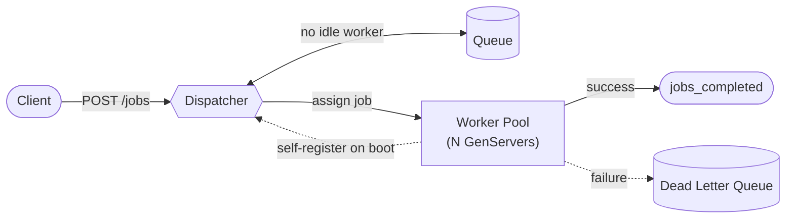

# eljobs

A job queue built from scratch in Elixir using OTP primitives — no external libraries,
just GenServer, Supervisor, ETS, and the Erlang `:queue` module.

The goal is to explore what you can build with Elixir/OTP when it comes to job queues:
how workers are managed, how backpressure works, and how the system behaves under load.

## How it works

- A `Dispatcher` GenServer receives jobs and routes them to idle workers. If no workers
  are available, the job is queued.
- A pool of `Worker` GenServers pulls jobs from the dispatcher, executes them, and
  reports back when done.
- Workers self-register with the dispatcher on startup — the dispatcher never needs to
  know about workers in advance.
- Jobs that fail (or exceed retry limits) are routed to a dead-letter queue (DLQ) rather
  than silently dropped.
- The number of workers spawned at boot is configurable via the `WORKER_COUNT`
  environment variable.

## Architecture



Workers self-register with the dispatcher on startup, so the pool size
(`WORKER_COUNT`) can change without the dispatcher needing to know about workers
ahead of time. Failed jobs go to the DLQ instead of being dropped. `GET /stats`
exposes queue depth, worker state, and DLQ count in real time.

## Running it

```bash
WORKER_COUNT=50 iex -S mix
```

Dispatch a job:

```elixir
iex> Dispatcher.dispatch(%{payload: "some string to hash"})
```

Check queue stats:

```bash
curl http://localhost:4000/stats
```

### Running with Docker

A multi-stage Dockerfile builds a minimal release image (Alpine-based runtime, no
Elixir/Erlang install needed since Mix releases bundle their own ERTS):

```bash
docker compose up -d
```

`docker-compose.yml` supports capping resources for testing under constrained
environments:

```yaml
cpus: "2"
mem_limit: 4g
```

`ERL_FLAGS=+S 2:2` should be set alongside a CPU cap so the BEAM's scheduler count
actually matches the enforced limit — otherwise the VM spins up schedulers based on the
host's full core count regardless of what the container is actually allowed to use.

## Load testing

```bash
make stress-test
```

Uses `wrk` with a Lua script to hammer the `/jobs` HTTP endpoint. Adjust concurrency and
duration in the `Makefile`. See [Benchmarks](#benchmarks) below for a more thorough
methodology and results using rate-controlled load.

## HTTP API

| Method | Path | Description |
|--------|------|-------------|
| POST | `/jobs` | Enqueue a job |
| GET | `/stats` | Queue and worker stats |

### POST /jobs

```json
{ "payload": "some string to hash" }
```

### GET /stats

```json
{
  "jobs_completed": 12000,
  "throughput": 157.89,
  "avg_exec_time_ms": 0.32,
  "avg_wait_ms": 0.47,
  "queued_jobs": 0,
  "peak_queue": 0,
  "busy_workers": 0,
  "idle_workers": 50,
  "dlq_jobs": 0,
  "avg_worker_utilization": 0.0
}
```

## Benchmarks

Benchmarked under a constrained container (**2 vCPU / 4GB RAM**, `WORKER_COUNT=50`,
Elixir 1.20.1 / OTP 29, Alpine runtime), with jobs doing simple string hashing
(CPU-bound work). Load generated with [vegeta](https://github.com/tsenart/vegeta) at
fixed rates, sustained for 60s per rate, with continuous polling of `/stats` and
container resource usage throughout each run.

| Rate (req/s) | CPU avg | p99 latency | Peak queue | Result |
|---:|---:|---:|---:|---|
| 1,000 | 45% | 0.47ms | 0 | Fully drained, no strain |
| 2,000 | 68% | 0.42ms | 0 | Fully drained, no strain |
| 4,000 | 89% | 0.50ms | 33 | Fully drained, comfortable |
| 8,000 | 171% | 25.2ms | 514 | Still recovers, visibly straining |
| 16,000 | 208% | 163.6ms | 121,451 | Queue never drains — collapse |
| 32,000 | 149%* | 31.1s | 96,809 | ~50% request failures, server in distress |

\* CPU drops at 32k because the server is largely stuck processing a massive backlog
rather than doing useful work; vegeta itself also couldn't sustain the requested rate
against a server this far behind (achieved ~5,500 req/s instead of 32,000).

**Takeaways:**
- Comfortable sustained throughput: **1,000–4,000 jobs/sec**, sub-ms p99, zero queue backlog
- Collapses sharply past **~8,000 req/s** — well before CPU maxes out, pointing to a
  dispatch bottleneck rather than a raw compute ceiling (worth digging into)
